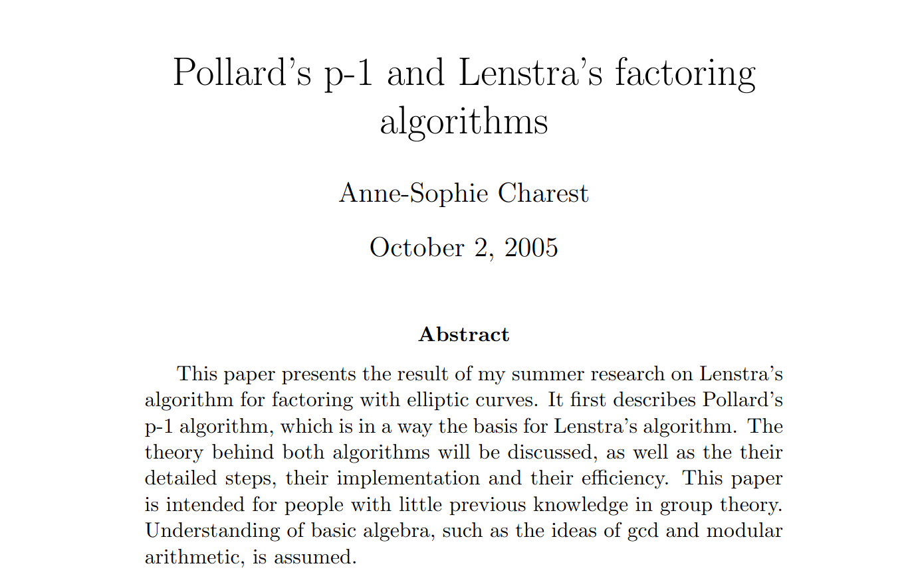

# Pollard's P-1 Factorization Algorithm
Coding the 1974 paper that introduced the Pollard p-1 factorization algorithm: _Theorems on Factorization and Primality Testing _ (Pollard, 1974). Complete writeup available on [LeetArxiv](https://leetarxiv.substack.com/p/pollards-p-1-factoring-algorithm).


The _1982 paper, Theorems on Factorization and Primality Testing_ (Pollard, 1974) introduces a special-purpose `p-1` algorithm for factoring integers composite integers `N`, into prime factors `p`, where `(p-1)` has small prime factors.


## Getting Started

The repo is written to be followed alongside this [LeetArxiv article](https://leetarxiv.substack.com/p/pollards-p-1-factoring-algorithm).

Clone the repo and run using:
```
clear && gcc main.c -o m.o -lm -lgmp -lmpfr -lflint && ./m.o 
```


You might also enjoy:
1. [Gauss-Lagrange 2D Lattice Reduction](https://leetarxiv.substack.com/p/2-dimensional-lattice-basis-reduction).
2. [Gauss Lattice Sieving](https://leetarxiv.substack.com/p/gauss-lll-sieve)

